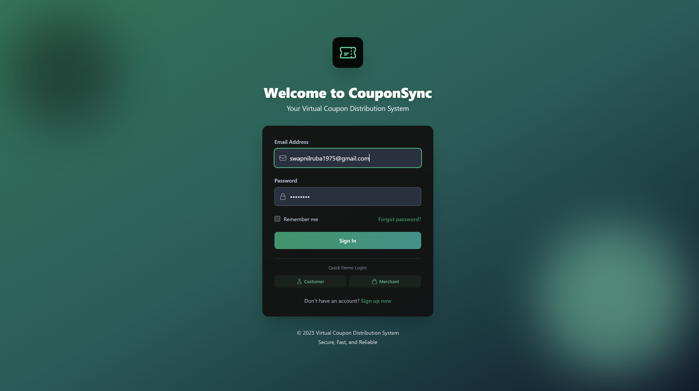
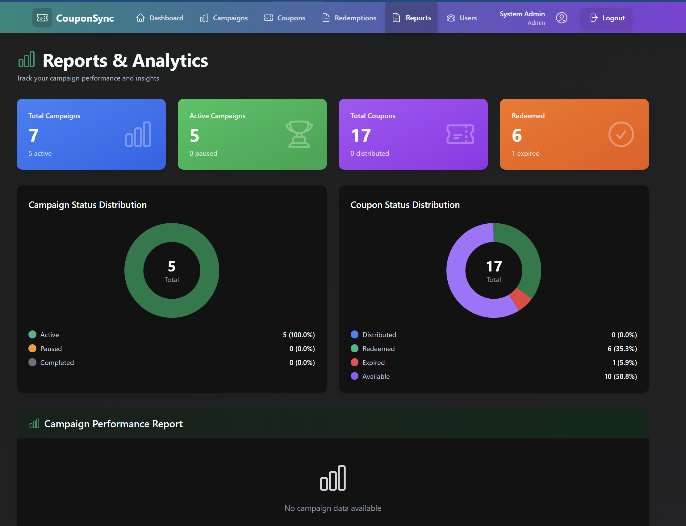

# Virtual Coupon Distribution System

A full-stack platform where merchants create and distribute discount coupons, and customers validate and redeem them in real time. Built with Node.js, Express, MySQL, and React.

---

## Screenshots

### Login Experience



The login screen uses the same CouponSync branding as the main application and provides a polished entry point with demo login shortcuts for customer and merchant roles.

### Reports Dashboard



The analytics dashboard gives merchants and admins a quick view of campaign totals, coupon distribution, redemption status, and campaign performance from one place.

---

## What it does

Merchants create coupon campaigns with configurable discount types, expiry windows, and redemption limits. The system generates unique codes and distributes them via email, SMS, or QR code. Customers redeem codes through a flow that checks expiry, fraud flags, and usage caps at the point of redemption. Admins get campaign analytics and exportable reports.

### Core capabilities

- Role-based access for Admin, Merchant, and Customer accounts
- Campaign creation, editing, pausing, resuming, and completion flows
- Unique coupon generation with expiry handling and QR code support
- Coupon claiming and redemption with validation checks
- Email/SMS distribution logging and retry support
- Reports, CSV export, and dashboard analytics
- JWT authentication, input validation, rate limiting, and fraud-related safeguards

---

## Tech Stack

| Layer        | Tech                                          |
| ------------ | --------------------------------------------- |
| Backend      | Node.js, Express.js                           |
| Database     | MySQL 8.0                                     |
| Frontend     | React.js, Tailwind CSS, Chart.js              |
| Auth         | JWT + bcryptjs                                |
| Distribution | Nodemailer (email), Twilio (SMS), qrcode (QR) |

---

## Design & Architecture

This project was built as part of a Software Engineering course and deliberately applies course concepts in its implementation:

**Layered Architecture** — the backend separates concerns across Routes → Middleware → Controllers → Services → Data layers. No business logic leaks into route handlers; no DB calls happen outside the service layer.

**Design Patterns**

- _Middleware chain_ — authentication, input validation, rate limiting, and RBAC are composed as independent Express middleware rather than bundled into controllers
- _Service layer pattern_ — coupon generation, expiry checks, and fraud detection live in dedicated service modules, keeping controllers thin
- _Repository-style DB access_ — all database interactions are isolated in model/service files, making them independently testable

**Transactional integrity** — coupon redemption is handled atomically to prevent double-redemption under concurrent requests.

**Role-based access control** — three roles (Admin, Merchant, Customer) with route-level enforcement via middleware.

**Scheduled jobs** — background tasks handle expiry propagation without coupling it to the request lifecycle.

---

## Documentation

- Product and setup overview: [`README.md`](README.md)
- Developer reference: [`docs/developer-guide.md`](docs/developer-guide.md)
- Project notes and demo reference: [`Software-Engineering-Project/PROJECT_NOTES.md`](Software-Engineering-Project/PROJECT_NOTES.md)

## Getting Started

### Prerequisites

- Node.js v14+
- MySQL 8.0+
- npm v6+

### Setup

```bash
git clone https://github.com/pestechnology/PESU_RR_AIML_F_P44_Virtual_Coupon_Distribution_System_CouponSync.git
cd PESU_RR_AIML_F_P44_Virtual_Coupon_Distribution_System_CouponSync
```

**Backend**

```bash
cd Software-Engineering-Project/backend
npm install
```

Create a `.env` file:

```env
DB_HOST=localhost
DB_USER=your_username
DB_PASSWORD=your_password
DB_NAME=vcds
JWT_SECRET=your_secret_key
PORT=5001
EMAIL_HOST=smtp.gmail.com
EMAIL_PORT=587
EMAIL_USER=your_email
EMAIL_PASSWORD=your_app_password
TWILIO_ACCOUNT_SID=your_twilio_sid
TWILIO_AUTH_TOKEN=your_twilio_token
```

Initialize the database:

```bash
mysql -u your_username -p < ../database/schema.sql
```

Start the server:

```bash
npm run dev    # development (auto-reload)
npm start      # production
```

**Frontend**

```bash
cd Software-Engineering-Project/frontend
npm install
npm start
```

Backend runs on `http://localhost:5001`, frontend on `http://localhost:3000`.

### Environment notes

- The backend defaults to port `5001`.
- The frontend is configured to call `http://localhost:5001/api`.
- MySQL should contain the `vcds` schema before starting the backend.

---

## Project Structure

```
├── Software-Engineering-Project/
│   ├── backend/
│   │   ├── controllers/      # Route handlers
│   │   ├── routes/           # API route definitions
│   │   ├── services/         # Business logic
│   │   ├── models/           # Data models
│   │   ├── middleware/       # Auth, validation, rate limiting, RBAC
│   │   ├── jobs/             # Scheduled tasks (expiry checks)
│   │   ├── db.js
│   │   └── server.js
│   ├── frontend/
│   │   └── src/
│   │       ├── components/
│   │       ├── pages/
│   │       ├── api/
│   │       └── context/
│   └── database/
│       ├── schema.sql
│       └── sample_data.sql
└── docs/
    ├── developer-guide.md
    ├── image1.png
    └── image2.png
```

---

## API Overview

Base URL: `http://localhost:5001/api`

Protected routes require `Authorization: Bearer <token>`.

| Method | Endpoint                        | Description           |
| ------ | ------------------------------- | --------------------- |
| POST   | `/auth/register`                | Register a new user   |
| POST   | `/auth/login`                   | Login and get JWT     |
| POST   | `/campaigns`                    | Create a campaign     |
| POST   | `/coupons/generate`             | Generate coupon codes |
| POST   | `/redemptions/redeem`           | Redeem a coupon       |
| GET    | `/redemptions/validate/:code`   | Validate a coupon     |
| GET    | `/reports/campaign/:id/metrics` | Campaign analytics    |
| POST   | `/distribution/email`           | Send coupons by email |
| POST   | `/distribution/sms`             | Send coupons by SMS   |

Full API reference and development guide: [`docs/developer-guide.md`](docs/developer-guide.md)

---

## Quality Checks

```bash
cd Software-Engineering-Project/frontend
npm run build

cd Software-Engineering-Project/backend
npm start
```

The frontend production build completes successfully. The backend starts against a configured MySQL instance and exposes `/health` for readiness checks.

---

## Demo Credentials

The sample data included in the project supports role-based testing:

- Admin: `admin@vcds.com` / `Admin@123`
- Merchant: `merchant@example.com` / `Admin@123`
- Customer: `john.doe@gmail.com` / `Customer@123`

---

## Contributors

| Member                                      | Role         |
| ------------------------------------------- | ------------ |
| [Vaibhav](https://github.com/Vaibhav2824)   | Scrum Master |
| [srijanjha](https://github.com/srijanjha05) | Developer    |
| [Tanishk](https://github.com/Tanishk-dot)   | Developer    |
| [swapnil](https://github.com/swapnil5053)   | Developer    |
